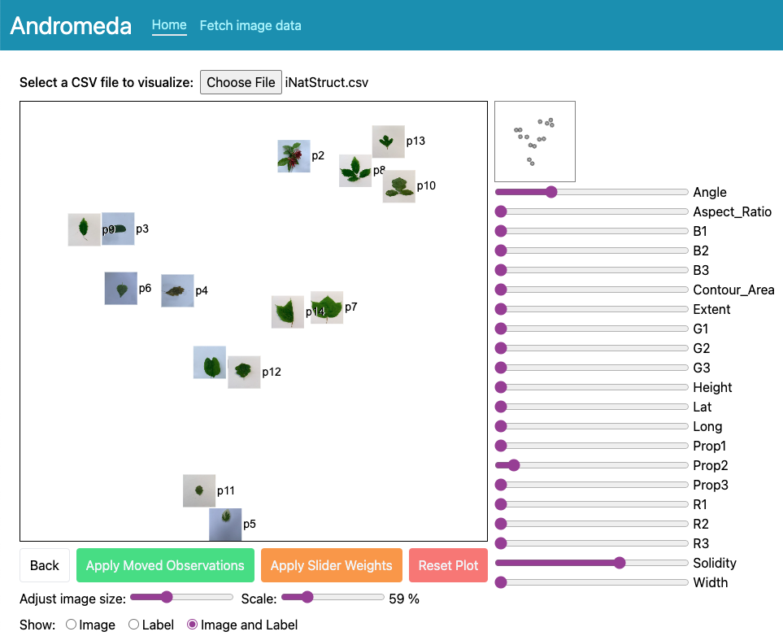

# Andromeda  [](https://zenodo.org/doi/10.5281/zenodo.12107162)
Andromeda allows users to visualize high dimensional data in a 2-dimensional plot using weighted multidimensional scaling. Through the interactive interface users can explore the relationships within their data by adjusting the variable weights and viewing an updated plot.  Alternatively users can arrange the items  in the plot so that Andromeda can determine new variable weights and create a new projection. 

This package also includes a page to fetch data from iNaturalist observations and pair them with satellite RGB and landcover data for analysis with Andromeda. 

An Andromeda instance allowing users to perform dimensional reduction on an uploaded CSV file can be found on the [Imageomics Hugging Face](https://huggingface.co/spaces/imageomics/Andromeda). 


<p align="center"><i>Sample data visualization with Andromeda.</i></p>

## Requirements
Deployment requires [Docker](https://www.docker.com/).

Development requires [python3](https://www.python.org/) and [nodejs](https://nodejs.org/).

## Deployment
Our primary deployment environment is [Hugging Face Spaces](https://huggingface.co/spaces/imageomics/Andromeda).
To deploy a new version change the version in the tag in the [Andromeda Space Dockerfile](https://huggingface.co/spaces/imageomics/Andromeda/blob/main/Dockerfile).
Hugging Face handles SSL encryption automatically. 
Deploying in another environment may require additional configuration; previous configurations are discussed in [Prior Configurations](https://github.com/Imageomics/Andromeda/wiki/Prior-Configurations).

## Development

To run the website locally without using Docker requires two terminal sessions.
1. Python Flask Backend API Server: navigate to the `andromeda` folder and run
```bash
export ANDROMEDA_DEV_MODE=Y
flask --app main run --debug
```
For more information, see the [Andromeda Backend README](https://github.com/Imageomics/Andromeda/blob/main/andromeda/README.md).

2. Frontend nodejs/react development server: navigate to the `andromeda-ui` folder and run
```bash
npm run dev
```
For requirements and test information, see the [Andromeda UI README](https://github.com/Imageomics/Andromeda/blob/main/andromeda-ui/README.md).

For instructions on building and running the Docker container see [Developing with Docker](https://github.com/Imageomics/Andromeda/wiki/Developing-with-Docker).

## Python Backend
The python backend consists of a [Flask](https://flask.palletsprojects.com/en/2.3.x/quickstart/#a-minimal-application) REST API server.
See the [Andromeda Python README](andromeda/README.md) for instructions on running locally.

## React Frontend
The frontend is a [typescript](https://www.typescriptlang.org/) [react](https://react.dev/) single page application.
The project was generated using [nextjs](https://nextjs.org/docs) as suggested in the react documentation.
See the [Andromeda React README](andromeda-ui/README.md) for instructions on running locally.

## Notebook
An older version of Andromeda written as a jupyter notebook is at [Andromeda_IMG.ipynb](Andromeda_IMG.ipynb).
